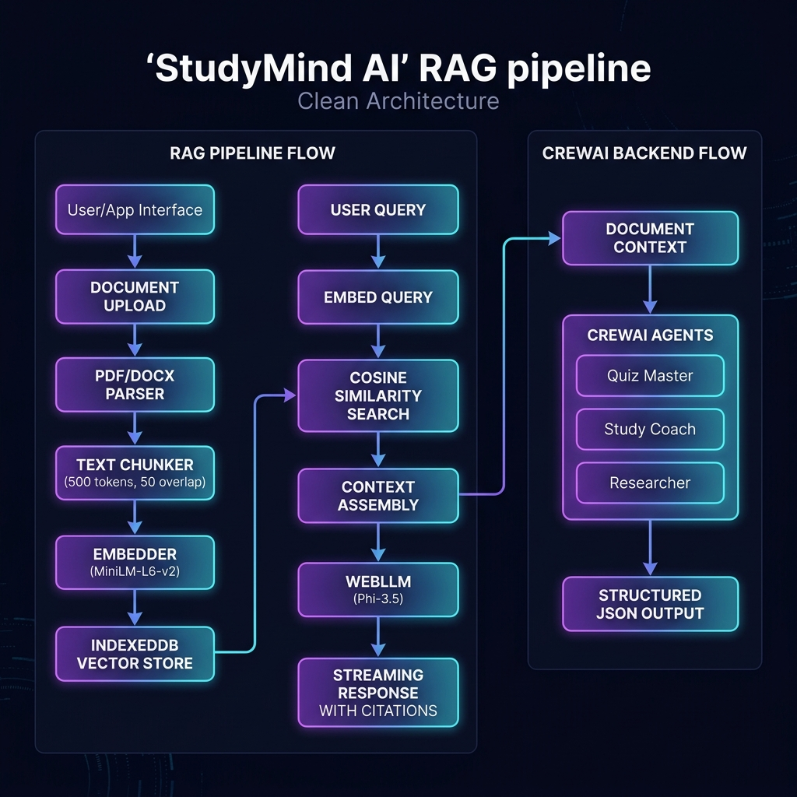
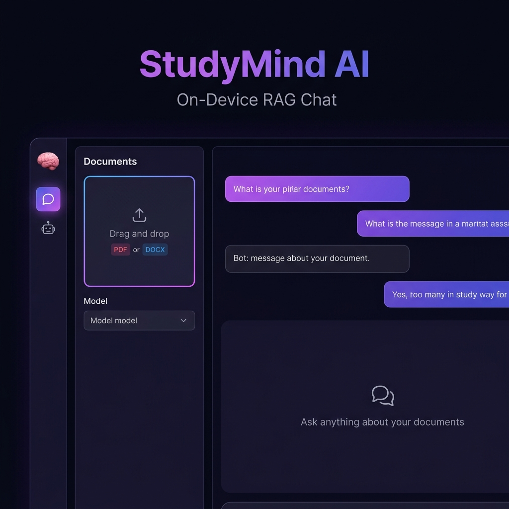
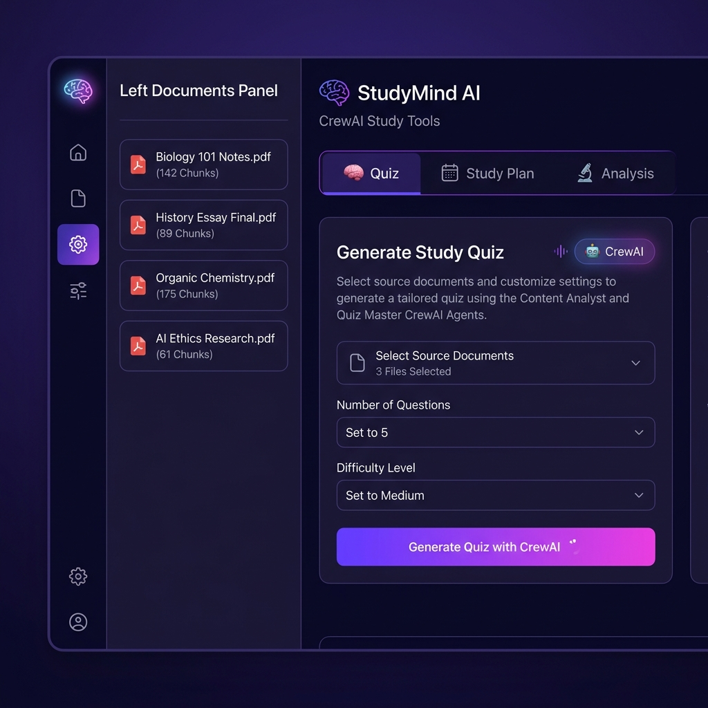

<p align="center">
  
</p>

<h1 align="center">🧠 StudyMind AI — Offline RAG Study Assistant</h1>

<p align="center">
  <strong>A privacy-first, offline-capable study assistant powered by on-device RAG and multi-agent AI</strong>
</p>

<p align="center">
  
  
  
  
  
  
</p>

<p align="center">
  <em>Built for OSDHack 2026 · All AI runs on your device · No data leaves your browser</em>
</p>

---

## 📸 Screenshots

<table>
  <tr>
    <td width="50%">
      
      <p align="center"><strong>💬 RAG Chat Interface</strong><br/>Ask questions about your documents with streaming AI responses</p>
    </td>
    <td width="50%">
      
      <p align="center"><strong>🤖 CrewAI Study Tools</strong><br/>AI-generated quizzes, study plans, and document analysis</p>
    </td>
  </tr>
</table>

---

## ✨ Features

### 🔒 100% Private & Offline
- **All AI inference runs locally** in your browser using WebLLM
- **No data ever leaves your device** — no cloud APIs needed for core RAG
- Works completely offline after initial model download

### 📄 Smart Document Processing
- Upload **PDF** and **DOCX** study materials
- Intelligent text chunking (~500 tokens with 50-token overlap)
- Real-time embedding using **MiniLM-L6-v2** (384-dim vectors)
- Persistent vector storage in **IndexedDB**

### 💬 On-Device RAG Chat
- Ask questions and get answers grounded in your documents
- **Streaming token generation** for responsive UX
- Source citations with document name and page numbers
- Persistent chat history across sessions

### 🤖 CrewAI Multi-Agent Tools (Backend)
- **🧠 Quiz Generation** — Content Analyst + Quiz Master agents create MCQs
- **📅 Study Plan** — Curriculum Designer + Study Coach build personalized schedules
- **🔬 Document Analysis** — Researcher + Summarizer produce deep study insights

---

## 🏗️ Architecture

```
┌─────────────────────────────────────────────────────────────────┐
│                        FRONTEND (React + Vite)                  │
├─────────────────────────────────────────────────────────────────┤
│                                                                 │
│  ┌──────────┐    ┌──────────┐    ┌────────────┐                │
│  │ PDF/DOCX │───▶│ Chunker  │───▶│  Embedder  │                │
│  │ Parser   │    │ (500 tok)│    │ (MiniLM)   │                │
│  └──────────┘    └──────────┘    └─────┬──────┘                │
│                                        │                        │
│                                        ▼                        │
│  ┌──────────┐    ┌──────────┐    ┌────────────┐                │
│  │ Streaming│◀───│  WebLLM  │◀───│ IndexedDB  │                │
│  │ Response │    │ (Phi-3.5)│    │ VectorStore│                │
│  └──────────┘    └──────────┘    └────────────┘                │
│                                                                 │
├─────────────────────────────────────────────────────────────────┤
│                   BACKEND (FastAPI + CrewAI)                     │
├─────────────────────────────────────────────────────────────────┤
│                                                                 │
│  ┌─────────────────┐  ┌─────────────────┐  ┌────────────────┐  │
│  │ Quiz Generation │  │  Study Plan     │  │  Analysis      │  │
│  │  • Analyst      │  │  • Extractor    │  │  • Researcher  │  │
│  │  • Quiz Master  │  │  • Coach        │  │  • Summarizer  │  │
│  └─────────────────┘  └─────────────────┘  └────────────────┘  │
│                                                                 │
└─────────────────────────────────────────────────────────────────┘
```

---

## 🛠️ Tech Stack

| Layer | Technology | Purpose |
|-------|-----------|---------|
| **LLM Inference** | [WebLLM (MLC-AI)](https://github.com/mlc-ai/web-llm) | On-device LLM — Phi-3.5-mini / Llama-3.2-1B |
| **Embeddings** | [@xenova/transformers](https://github.com/xenova/transformers.js) | MiniLM-L6-v2 for 384-dim embeddings |
| **Vector Store** | IndexedDB + Cosine Similarity | Browser-native persistent vector search |
| **File Parsing** | pdf.js-dist, mammoth | PDF and DOCX text extraction |
| **Frontend** | React 18 + Vite | Modern, fast single-page application |
| **Styling** | Custom CSS Design System | Dark premium theme with violet/indigo palette |
| **Backend** | FastAPI + CrewAI | Multi-agent AI for quizzes, plans, analysis |
| **LLM Backend** | OpenAI / Ollama | Configurable LLM for CrewAI agents |
| **Web Worker** | Web API | Non-blocking LLM inference thread |

---

## 🚀 Quick Start

### Prerequisites

- **Node.js** ≥ 18
- **Python** ≥ 3.10 (for CrewAI backend, optional)
- A modern browser with WebGPU support (Chrome 113+, Edge 113+)

### 1. Clone the Repository

```bash
git clone https://github.com/kulkarniparth30/OSDK_RAG_ASSISTANT.git
cd OSDK_RAG_ASSISTANT
```

### 2. Frontend Setup

```bash
cd offline-rag-study-assistant
npm install
npm run dev
```

The app will be available at `http://localhost:5173`

### 3. Backend Setup (Optional — for CrewAI features)

```bash
cd backend
pip install -r requirements.txt
cp .env.example .env
# Edit .env with your OpenAI key or set USE_OLLAMA=true
python main.py
```

The backend runs at `http://localhost:8000`

> **Note**: The core RAG chat works **entirely offline** without the backend. The backend is only needed for CrewAI-powered quiz, study plan, and analysis features.

---

## 📖 Usage Guide

### 📤 Upload Documents
1. Click or drag PDF/DOCX files into the upload zone in the left panel
2. Watch real-time progress as documents are parsed, chunked, and embedded
3. All processing happens locally in your browser

### 💬 Ask Questions (RAG Chat)
1. Wait for the AI model to finish loading (first time downloads ~2GB)
2. Type your question in the chat input
3. Get streaming, citation-backed answers from your documents
4. Works completely offline after model download

### 🤖 Use CrewAI Tools
1. Start the backend server (`cd backend && python main.py`)
2. Switch to the "CrewAI Tools" tab via the robot icon in the sidebar
3. Generate quizzes, study plans, or deep analysis from your uploaded material

---

## 📁 Project Structure

```
OSDK_RAG_ASSISTANT/
├── offline-rag-study-assistant/       # Frontend (React + Vite)
│   ├── src/
│   │   ├── components/
│   │   │   ├── ChatWindow.jsx         # Main RAG chat interface
│   │   │   ├── DocUploader.jsx        # File upload with pipeline
│   │   │   ├── MessageBubble.jsx      # Chat message component
│   │   │   ├── ModelSelector.jsx      # LLM model picker
│   │   │   ├── OfflineIndicator.jsx   # Online/offline status
│   │   │   ├── CrewAIPanel.jsx        # CrewAI tools container
│   │   │   ├── QuizView.jsx           # Quiz display & interaction
│   │   │   ├── StudyPlanView.jsx      # Study plan renderer
│   │   │   └── AnalysisView.jsx       # Analysis results view
│   │   ├── lib/
│   │   │   ├── parsing/               # PDF & DOCX parsers
│   │   │   ├── chunking/              # Text chunking engine
│   │   │   ├── embeddings/            # Transformer embeddings
│   │   │   ├── vectorstore/           # IndexedDB vector store
│   │   │   ├── llm/                   # WebLLM client & worker
│   │   │   └── rag/                   # RAG pipeline orchestration
│   │   ├── App.jsx                    # Root application shell
│   │   ├── App.css                    # Complete design system
│   │   └── main.jsx                   # Entry point
│   ├── index.html
│   ├── vite.config.js
│   └── package.json
│
├── backend/                           # Backend (FastAPI + CrewAI)
│   ├── main.py                        # API server with 3 agent crews
│   ├── requirements.txt               # Python dependencies
│   ├── .env.example                   # Environment config template
│   └── .env                           # Your local config (gitignored)
│
├── screenshots/                       # Project screenshots
│   ├── chat_interface.png
│   ├── crewai_tools.png
│   └── architecture_diagram.png
│
└── README.md
```

---

## ⚙️ Configuration

### Frontend Model Selection

The app supports two LLM models (selectable in the UI):

| Model | Size | Quality | Speed |
|-------|------|---------|-------|
| **Phi-3.5-mini-instruct** (default) | ~2 GB | ⭐⭐⭐⭐ | ⭐⭐⭐ |
| **Llama-3.2-1B-Instruct** (fallback) | ~1 GB | ⭐⭐⭐ | ⭐⭐⭐⭐ |

### Backend LLM Options

Configure in `backend/.env`:

```env
# Option 1: OpenAI (recommended for quality)
OPENAI_API_KEY=sk-your-key-here

# Option 2: Local Ollama (free, no API key)
USE_OLLAMA=true
OLLAMA_MODEL=llama3.2:3b
OLLAMA_BASE_URL=http://localhost:11434
```

---

## 🔑 Key Design Decisions

- **Privacy First**: Core RAG pipeline runs entirely in-browser with WebLLM and IndexedDB — zero server calls
- **Hybrid Architecture**: On-device RAG for chat + optional CrewAI backend for advanced study tools
- **Web Workers**: LLM inference runs in a separate thread to keep the UI responsive
- **Streaming UX**: Token-by-token response display for a natural chat feel
- **Persistent Storage**: Documents, embeddings, and chat history persist in IndexedDB across sessions

---

## 🏆 Built For

**OSDHack 2026** — Open Source Developer Hackathon

This project demonstrates a fully functional, privacy-preserving AI study assistant that combines:
- On-device LLM inference (WebLLM)
- Browser-native vector search (IndexedDB)
- Multi-agent AI collaboration (CrewAI)

---

## 📄 License

This project is open source and available under the [MIT License](LICENSE).

---

<p align="center">
  <strong>Made with 💜 by <a href="https://github.com/kulkarniparth30">Parth Kulkarni</a></strong>
</p>
